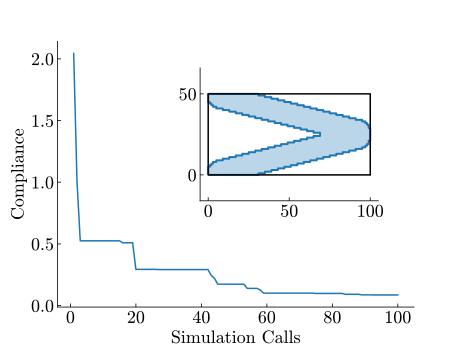

# tobbo
A package for Topology Optimization (TO) using Black-Box Optimization (BBO) methods: *tobbo*. TO problems are concerned with finding optimal material distributions within some spacial domain given an objective. Conventially these problems are solved using special purpose gradient-based optimization methods.

BBO methods provide a general framework for solving TO problems for arbitrary objectives, geometry parameterization, and physics. That is, there is no need for devising gradient-based procedures. For example in the case of nonlinear dynamics, such as the simulation of crash impacts, gradient-based optimization methods are infeasible; BBO uses only a trial $\mathbf{x}$ and observation $f_\text{obj}(\mathbf{x})$ scheme.


-------

This repo is two-fold in structure as it houses experiment scripts (Case-Study), as used for a master thesis project, alongside a standalone package (tobbo) which evolved throughout the project (Package).

**Contents**
- Case-Study
- Package
    - Installation
    - Getting Started
    - tobbo Package Structure
- Team


## Case-Study
In our study we consider minimization of compliance for static loading of a horizontal cantilever (2D, plane-stress), under constraint of using only 50% of the design domain as material, the rest is void. This is known as a classic *structural* TO problem. The schematic in the introduction above shows evolution of such a problem using the CMA-ES BBO method and four (symmterized) *Curved Moving Morphable Component* (Curved MMC) beams.

Such a Curved MMC has 10 Degrees of Freedom (DOF), two endpoints, a thickness, and five additional deformation parameters. Note the design domain has 100x50 elements meaning that the problem originally has 5000 DOF. By using parameterization like this we effectively reduce the DOF by constraining the desings, in this case to be only (curved) beam structures. This results in problems like this to be tractable for BBO methods given the reduced effective dimension.

An other parameterization could be to only use non-deformed straight beams: 5 DOF per beam. These different parameterizations lead to different characteristics of the fitness landscapes. Different BBO algorithms are designed to exploit different landscape features; unfortunately there is no jack of all trades. 

*Our goal is to reseach the interplay between parameterizations and  BBO procedures.*


### Constrained Problem Definition
Volume is penalized based on the exceeded volume, and connectivity is penalized based on the least distance required to connect the disconnected design. That is, the design needs to be connected to the wall and loading point, and to the design itself, such that from anywhere on the structure we can move to any other point on the structure.

The infeasible region creates an artificial valley towards feasible which is relative to the simulation cheaply computed since it only consists of simple geometrical checks.

Given we only have a limited (expensive) simulation budget, *the optimizer is free to make as many infeasible calls as it want.* The schematic in the introduction shows infeasible designs in orange and feasible designs that went through the actual simulation in blue.

### Main Findings
Our results show that parameterization has a dominant influence on optimization performance in constrained TO. When the chosen parameterization effectively captured the structural characteristics of the problem, such as the Curved MMCs, all algorithms reliably converged to high-quality designs. 

Conversely, weak or overly restrictive parameterizations such as Honeycomb parameterization create a strong reliance on Algorithm Selection for competitive performance.

We demonstrate that well-chosen design representations are key to achieving robust and efficient optimization outcomes in a constrained real-world engineering problem, independent of using a simple or a state-of-the-art optimizer.


### Reproducibility
Our experiments can be reproduced using `main.py`, for the three dimensions: **10D**, **20D**, and **50D** we create a problem definition using the three different parameterization above: **Honeycomb**, **MMC**, and **Curved MMC** ($3\times3$). For each of these 9 settings we study the optimization procedure for three different BBO algorithms:
- **DE** a classical Differential Evolution algorithm driven by population recombination and mutation.
- **CMA-ES** a robust, evolution-based optimizer for continuous search spaces that adapts its sampling distribution via covariance matrix updates.
- **HEBO** a state-of-the-art Bayesian Optimization method designed for sample efficiency on low-budget continuous problems.

## Package
### Installation

After review the package will be added to pypi, for now

```
# assuming python>=3.11 
pip install ./package/
```

## Minimal Example
An explainer for this minimal example alongside more examples can be found in `tutorial.ipynb`

```
from tobbo.core import Topology, OptimizationMethod, run_experiment
from tobbo.parameterizations.mmc import Capsules, MMCEndpointsConfig
from tobbo.problems.cantilever import create_horizontal_cantilever_problem

topology = Topology(
    continuous=False,       # using the rasterized (discrete) geometry for constraints
    domain_size=(100, 50),  # domain size (100x50)
    density=1.              # cell size per unit length; mesh size (100x50) in this case
)
parameterization = Capsules(
    topology,               # used to initialize normalization factors
    symmetry_x=False,       # mirror in x-direction
    symmetry_y=True,        # mirror in y-direction
    representation=MMCEndpointsConfig, 
    n_components=1,         # before mirroring
    deformer=None,          # straight beam
    n_samples=1000          # no. vertices of polygon prior to rasterization to mesh
)

problem = create_horizontal_cantilever_problem(topology, parameterization)

run_experiment(problem, budget=100, seed=1, name='minimal-example', method=OptimizationMethod.CMAES)
problem.plot_log()
```
Outputs
```
(4_w,8)-aCMA-ES (mu_w=2.6,w_1=52%) in dimension 5 (seed=1, Mon Oct 13 09:44:41 2025)
Iterat #Fevals   function value  axis ratio  sigma  min&max std  t[m:s]
    1      8 6.697056274847714e+02 1.0e+00 2.51e-01  2e-01  3e-01 0:00.1
    2     16 2.043857152229669e+00 1.3e+00 2.92e-01  3e-01  3e-01 0:00.3
    3     24 5.608504366272913e+02 1.5e+00 2.92e-01  2e-01  3e-01 0:00.3
   22    176 5.092354039324587e-01 2.9e+00 4.35e-02  2e-02  4e-02 0:03.6
   27    216 2.205799576087525e-01 3.7e+00 4.16e-02  2e-02  5e-02 0:08.7
   32    256 1.049632949995606e-01 4.3e+00 6.09e-02  2e-02  7e-02 0:14.0
[stop]
```


### `tobbo` Package Structure

```
./package/ the standalone tobbo package
    tobbo/
        core/
        models/
        parameterizations/
        problems/
```


## Authors
After review the authors will be added.

...